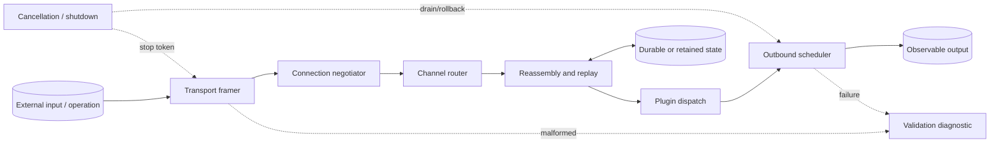
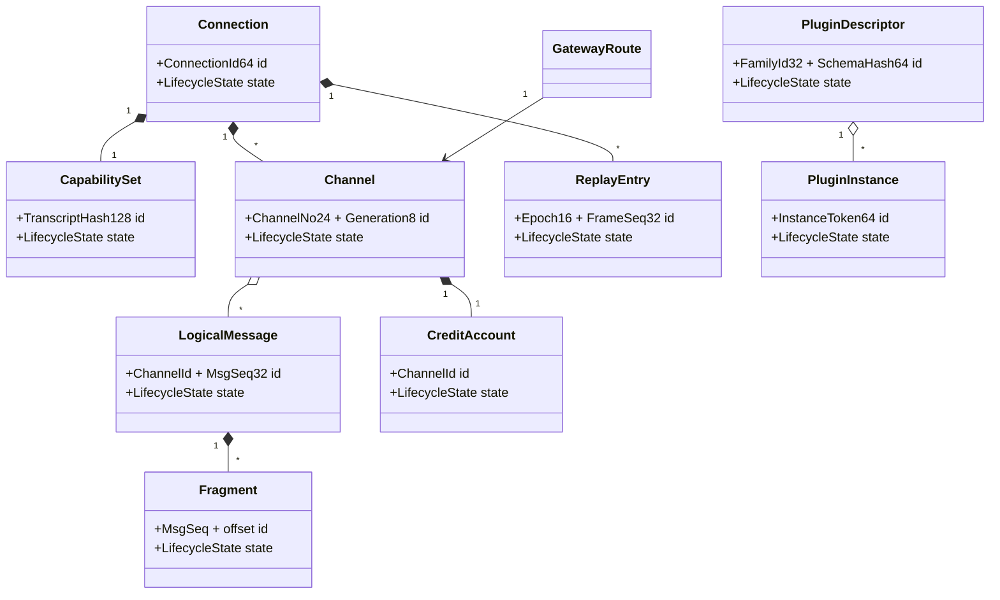
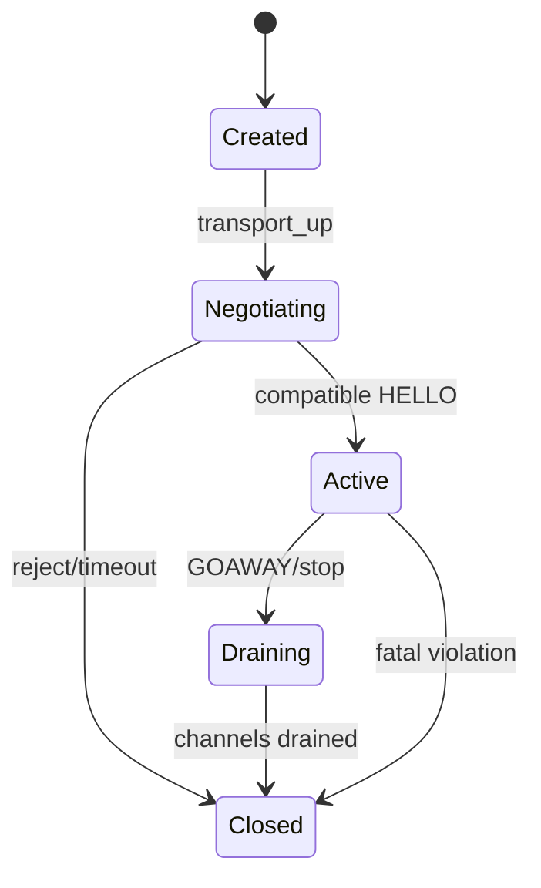
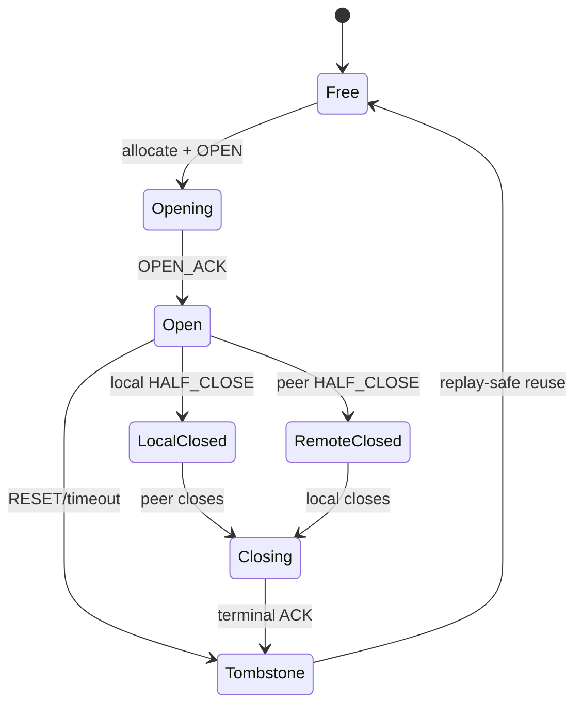

# 1. Project Identity

| Item | Specification |
| --- | --- |
| Name | Lattice — Multiplexed Binary-Protocol Gateway |
| Description | A stateful local gateway core that negotiates capabilities, multiplexes generated channels, reassembles fragmented messages, enforces flow control, and dispatches versioned plugin message families. |
| Language | C++20 |
| Platforms | Linux sockets and deterministic in-memory transports; optional BSD/Windows transport adapters |
| Source size | MVP 10,000–13,000 lines; full 30,000–40,000 lines |
| Test size | 13,000–19,000 lines |
| License | Proprietary internal license |

**Substantial because:** Lattice is not a framing wrapper: correctness spans bidirectional negotiation, reusable channel numbers with generations, partial messages, credit accounting, replay windows, half-close, plugin ownership, and bounded shutdown under backpressure.

# 2. Product Definition

**Problem/users:** Products that exchange several logical request/event streams over one reliable byte transport need precise lifecycle and resource semantics. Users: systems-tool developers, local-agent authors, test-infrastructure teams, and engineers embedding binary control planes

| Use case | Input | Result |
| --- | --- | --- |
| Local agent bridge | Two Unix-domain transports with different optional capabilities | Gateway negotiates each side and forwards only mutually representable channel traffic. |
| Telemetry plus control | Ordered events and request/response messages sharing one connection | Per-channel windows prevent telemetry from starving control messages. |
| Deterministic incident replay | Recorded frame/event trace including time advances | The engine reproduces negotiation, retransmission, close, and timeout decisions byte-for-byte. |

- **Inputs:** arbitrary transport byte fragments, timer events, open/send/credit/half-close commands, plugin registrations, and cancellation
- **Outputs:** encoded frames, decoded plugin messages, channel events, acknowledgements, diagnostics, and close reasons
- **Observable behavior:** strict message ordering per channel, bounded queued bytes, negotiated feature use only, deterministic timer behavior, and explicit terminal state
- **MVP:** one connection pair, HELLO negotiation, channel open/data/credit/close, fragmentation/reassembly, ordered delivery, fixed replay window, one built-in plugin, in-memory and Unix transport adapters
- **Full version:** gateway translation policies, dynamic plugin families, selective acknowledgement, retransmission timers, channel priority scheduling, half-close, keepalive, cancellation propagation, metrics, trace replay, and concurrent connections
- **Non-goals:** TLS implementation, UDP reliability, HTTP compatibility, arbitrary remote code loading, cryptographic authentication, or a general RPC framework
- **Originality:** The protocol uses a compound `channel_number:generation` identity, byte-credit tied to reassembled logical payload, explicit plugin schema hashes, and replay epochs.
- **Project-specific coverage:** The protocol explicitly covers connection negotiation; channel-number generations and reuse; fragmentation and reassembly; byte and message flow-control windows; per-channel ordering; retransmission and replay windows; plugin-defined messages; half-close and full-close behavior; timeouts, cancellation, and backpressure; and a model-based connection-event sequence fuzzer.

# 3. Engineering Difficulty Profile

| Source | Why difficult | Invariant consequence |
| --- | --- | --- |
| Negotiated behavior | Both peers advertise versions, limits, and required/optional features before channels exist. | A frame valid under one capability set may be illegal on another connection. |
| Fragment/reassembly state | Fragments can arrive across reads, messages, channels, and cancellation boundaries. | Lengths, sequence numbers, and reservations must agree before plugin decode. |
| Flow control | Send credit, receive reservation, queued bytes, and transport backpressure interact. | Double credit or forgotten release can violate memory bounds or deadlock. |
| Channel reuse | Numeric IDs are recycled only with a new generation after terminal acknowledgement. | Late frames must not attach to a newly opened channel. |
| Plugin lifetime | Queued messages and callbacks may outlive registration requests but not plugin code. | Unload requires quiescence across dispatch, retransmit, and diagnostics. |
| Timeout/replay recovery | Timers trigger retries, channel failure, or connection close while frames are in flight. | Decisions must be deterministic and never revive terminal state. |

**Cross-phase validation:** A DATA fragment length is checked in the frame decoder, charged to the receive budget, merged into a message, checked against the declared logical length, then decoded again under the negotiated plugin schema. Shallow framing-only or stateless implementations are incorrect.

# 4. System Architecture



- **Processes/threads:** Each connection owns one event loop and all mutable protocol state.
- **Normal path:** parse HELLO, derive an immutable capability set, open a generated channel, reserve send credit, fragment a logical message, frame and schedule fragments, acknowledge receipt.
- **Malformed path:** reject the smallest affected scope: malformed framing closes the connection; illegal channel state resets that channel when safe; plugin payload errors produce a typed message rejection.
- **Cancel/shutdown:** stop new opens, mark outbound halves closing, flush bounded control frames, cancel plugin tasks by token, discard unsent data with credit reconciliation.
- **Recovery:** after transient write/read interruption in a replay-capable session, a peer resumes only within the negotiated epoch and replay window; otherwise both sides close with `ResumeRejected` and require a fresh connection.

| Module | Responsibility | Input | Output | Owns | Invariant | Dependencies |
| --- | --- | --- | --- | --- | --- | --- |
| ConnectionEngine | Owns negotiated state and event dispatch. | Transport/timer/API events | Frames and callbacks | Connection state, channels | All mutable connection state changes on one loop. | Negotiator, ChannelTable |
| FrameCodec | Incremental LTX framing and CRC validation. | Byte fragments | Frame views | Header scratch, input window | No frame view before bounded length validation. | CheckedReader |
| Negotiator | HELLO/version/feature/limit agreement. | HELLO frames, local policy | CapabilitySet | Handshake transcript | Agreed limits never exceed either peer or local policy. | FrameCodec |
| ChannelState | Tracks ordering, halves, windows, and message sequences. | Channel events | Deliveries/control frames | Queues, counters | Credits and sequence ranges remain nonnegative and monotonic. | Reassembler, Scheduler |
| Reassembler | Builds bounded logical messages from fragments. | DATA fragments | Complete message lease | Fragment map/buffer | At most one interpretation per byte range. | BudgetManager |
| ReplayManager | Tracks sent frames, acknowledgements, and epochs. | Sent/ACK/timer events | Retransmit work | Replay ring, timers | Acknowledged frames are never retransmitted. | TimerWheel, Scheduler |
| FlowController | Accounts byte/message credit and backpressure. | Reservations, releases, CREDIT | Availability events | Per-channel/connection budgets | Reserved + available equals negotiated window. | ChannelState |
| PluginRegistry | Registers schema families and creates instances. | Descriptors, negotiation data | Plugin leases | Factories, quiescence refs | A dispatched type resolves to one negotiated descriptor. | PluginDispatcher |
| PluginDispatcher | Decodes and invokes typed message handlers. | Complete payload lease | Response/events | Task tokens, plugin instances | Callback completion targets the same live channel generation. | PluginRegistry, Executor |
| GatewayPolicy | Maps channels/messages between two connections. | Typed events, capability sets | Forward/transform/drop actions | Route table | Forwarded semantics are representable on destination. | ConnectionEngine |

# 5. Proposed Repository Layout

```text
    lattice/
    ├── CMakeLists.txt
    ├── cmake/{Warnings.cmake,Sanitizers.cmake,FuzzTargets.cmake}
    ├── include/lattice/{connection.hpp,channel.hpp,plugin.hpp,transport.hpp,error.hpp}
    ├── src/format/{frame_codec.cpp,bounded_reader.cpp,canonical_writer.cpp}
    ├── src/connection/{engine.cpp,negotiator.cpp,event_loop.cpp,shutdown.cpp}
    ├── src/channel/{channel_table.cpp,channel_state.cpp,reassembler.cpp,flow.cpp}
    ├── src/replay/{replay_window.cpp,timer_wheel.cpp}
    ├── src/schedule/{outbound_scheduler.cpp,write_batch.cpp}
    ├── src/plugin/{registry.cpp,dispatcher.cpp,builtin_echo.cpp}
    ├── src/gateway/{gateway.cpp,policy.cpp}
    ├── src/transport/{memory_transport.cpp,unix_transport.cpp}
    ├── tests/unit/{frame_tests.cpp,channel_tests.cpp,flow_tests.cpp,replay_tests.cpp}
    ├── tests/integration/{handshake.cpp,multiplex.cpp,half_close.cpp,gateway.cpp}
    ├── fuzz/{fuzz_frame.cpp,fuzz_connection_events.cpp,fuzz_gateway_trace.cpp}
    ├── tools/{lattice_dump.cpp,lattice_replay.cpp}
    ├── examples/{echo_plugin.cpp,local_gateway.cpp}
    ├── docs/{ARCHITECTURE.md,LTX_PROTOCOL.md,PLUGIN_API.md}
    ├── corpus/{frames,events,traces}/
    └── scripts/{run_fuzz.sh,make_trace.py,soak.sh}
```

| Important file | Purpose |
| --- | --- |
| `src/connection/engine.cpp` | Only mutation point for connection and channel state. |
| `src/channel/reassembler.cpp` | Fragment overlap, reservation, completion, and cancellation rules. |
| `src/replay/replay_window.cpp` | Epoch, ACK range, retry, and retirement semantics. |
| `src/plugin/registry.cpp` | Schema negotiation and quiescent plugin lifetime. |
| `fuzz/fuzz_connection_events.cpp` | Model-based bytes-to-event connection sequence harness. |
| `docs/LTX_PROTOCOL.md` | Normative LTX/1 frame and state specification. |

Tests and fuzzers link production libraries; no duplicate decoder/state logic.

# 6. Core Data Model

| Entity | Role | Ownership | Mutability | Stable ID | Thread safety |
| --- | --- | --- | --- | --- | --- |
| Connection | Negotiated protocol session | Unique ConnectionEngine owner | Mutable on event loop | ConnectionId64 | Loop-confined |
| CapabilitySet | Immutable negotiated limits/features | Shared by connection objects | Immutable | TranscriptHash128 | Thread-safe |
| Channel | Bidirectional ordered logical stream | ChannelTable slot | Mutable on loop | ChannelNo24 + Generation8 | Loop-confined |
| LogicalMessage | Reassembled plugin payload | MessageLease | Immutable after completion | ChannelId + MsgSeq32 | Task-transferable |
| Fragment | One DATA frame range | Frame event then reassembly owner | Immutable | MsgSeq + offset | Value type |
| CreditAccount | Byte/message availability ledger | ChannelState | Mutable | ChannelId | Loop-confined |
| PluginDescriptor | Message family schema/version contract | Registry immutable record | Immutable | FamilyId32 + SchemaHash64 | Thread-safe |
| PluginInstance | Per-connection or per-channel handler | Registry lease | Plugin-defined | InstanceToken64 | Executor-affine |
| GatewayRoute | Mapping between source/destination channels | GatewayPolicy | Mutable on gateway loop | RouteId64 | Loop-confined |



**Lifecycles/serialization:** Connection state is Created → Negotiating → Active → Draining → Closed. Invalid/transitional states are explicit; cache-only fields never serialize.

# 7. Custom Format or Protocol Specification

## LTX/1 multiplexed frame protocol

| Rule | Definition |
| --- | --- |
| Magic | `4C 54 58 31 (`LTX1`)` |
| Endian | network byte order for fixed integers; canonical ULEB128 for payload lengths |
| Integers | u8/u16/u24/u32/u64 plus minimal ULEB128 capped at 5 bytes for frame payloads |
| Alignment | no inter-frame padding; plugin payload alignment is private to that family and cannot affect frame length |
| Versioning | HELLO advertises version ranges and feature TLVs; the selected major must match and each required TLV must be understood |
| Integrity | CRC32C over fixed header, extension bytes, and payload; reliable transport is assumed but corruption is still detected |
| Depth | 8 extension nesting levels and plugin-declared depth no greater than negotiated 32 |
| Canonical | minimal varints, sorted HELLO TLVs, zero reserved bits, ordered ACK ranges, and no empty nonterminal DATA fragment |
| Unknown | unknown optional extension TLVs are skipped; unknown frame types or required extensions close the connection |
| Truncation | `NeedMoreData` until transport EOF; EOF inside a frame becomes `TruncatedFrame` and closes without plugin dispatch |

### Header/footer and framing

| Field | Encoding | Constraint | Meaning |
| --- | --- | --- | --- |
| magic | u32 | `LTX1` | Resynchronization is not attempted after mismatch. |
| type/flags | u8 + u8 | Reserved bits zero | Frame kind and legal modifiers. |
| ext_len | u16 | <= negotiated max_header | Extension TLV byte count. |
| channel_no/generation | u24 + u8 | Control uses 0/0 | Compound channel identity. |
| frame_seq | u32 | Monotonic within replay epoch | ACK/replay ordering. |
| payload_len | ULEB128 | <= max_frame-header | Exact payload bytes. |
| extensions | TLV sequence | Sorted by type in canonical mode | Message sequence, fragment range, epoch, etc. |
| crc32c | u32 | Covers all preceding frame bytes | Frame integrity. |

The fixed prefix is `magic:u32, type:u8, flags:u8, ext_len:u16, channel_no:u24, generation:u8, frame_seq:u32, payload_len:ULEB128`. Extension bytes and payload follow, then `crc32c:u32`. `channel_no=0` is connection control. Total frame size is capped by negotiated `max_frame`.

#### Connection termination layout

LTX/1 has no standalone byte-stream footer. Closure is expressed by ordinary framed control records so it remains replayable and generation-aware.

| Terminal element | Encoding | Constraint | Meaning |
| --- | --- | --- | --- |
| `HALF_CLOSE` | type `0x14`; direction plus final message sequence TLVs | No later `DATA` is legal in that direction | Closes one sender half while preserving the reverse half. |
| `RESET` | type `0x15`; stable reason plus final acknowledged sequence | Must target the currently live channel generation | Immediately terminates one logical channel. |
| `GOAWAY` | type `0x22`; last accepted channel plus reason | Control channel only; new opens beyond the boundary are rejected | Begins graceful connection drain. |
| transport EOF | no bytes | Clean only after protocol-required terminal state; otherwise abrupt close | Converts incomplete frames and channels into one deterministic connection cause. |

The decoder never scans for a footer or resynchronization magic after corruption; a framing-integrity failure closes the connection.

| Type | Code | Payload | Constraints | Semantics |
| --- | --- | --- | --- | --- |
| HELLO | 0x01 | Version ranges, limits, features, plugin schemas | Control channel before Active | Negotiates immutable session capabilities. |
| OPEN | 0x10 | Initial windows, priority, plugin family | Fresh compound channel ID | Requests logical channel creation. |
| DATA | 0x11 | Message fragment bytes plus msg/offset/total TLVs | Within credit and reassembly caps | Carries one fragment. |
| ACK | 0x12 | Epoch and sorted frame/message ranges | No overlapping ranges | Retires replay entries and optionally delivery state. |
| CREDIT | 0x13 | Byte and message increments | Nonzero; checked addition | Restores sender allowance. |
| HALF_CLOSE | 0x14 | Direction and final message sequence | No later DATA in closed direction | Closes one sending half. |
| RESET | 0x15 | Stable reason and final acknowledged sequence | Targets live generation | Terminates one channel. |
| PING/PONG | 0x20/0x21 | Opaque 64-bit token | Control channel | Keepalive and RTT measurement. |
| GOAWAY | 0x22 | Last accepted channel and reason | Connection control | Starts graceful drain. |
| RESUME | 0x23 | Prior session ID, epoch, ACK summary | Replay capability required | Attempts bounded replay continuation. |

### Examples and streaming behavior

- **Valid 1:** Both peers send HELLO selecting major 1, 64 KiB frames, 1 MiB connection window, and plugin family 7/schema hash H; client opens channel `5:1`, sends a two-fragment message, receives ACK and CREDIT.
- **Valid 2:** Channel `9:3` sends HALF_CLOSE with final message 12 while the reverse direction remains open for a response; both halves later close and the slot enters Tombstone before reuse as `9:4`.

- **Malformed 1:** DATA declares total length 10 but fragment offset 8 with length 4; reset the channel with `FragmentRange`, release reservation, and do not call the plugin.
- **Malformed 2:** A late frame for `channel 5:generation 1` arrives after slot reuse as generation 2; discard with stale-generation accounting and never mutate generation 2.
- **Malformed 3:** CREDIT addition overflows the negotiated window; close the connection for flow-control violation rather than saturating.
- **Malformed 4:** HELLO contains duplicate required plugin family TLVs with different hashes; reject negotiation deterministically as ambiguous.

- **Partial input:** Frame parsing is cursor-based and may pause inside the prefix, varint, extensions, payload, or CRC. Payloads larger than the contiguous threshold are delivered as chained immutable buffers. The decoder consumes nothing on `NeedMoreData` beyond bytes copied into its fixed header scratch; transport EOF closes all incomplete channels with one connection-level cause.

# 8. State Machines and Lifecycle Rules

### Connection negotiation, active service, and drain

**Scope:** ConnectionEngine, Negotiator, ChannelTable, ReplayManager, transport callbacks, and plugin capability bindings.

| From | Event | Guard | Action | To |
| --- | --- | --- | --- | --- |
| Created | transport_up | callbacks installed | send local HELLO; start deadline | Negotiating |
| Negotiating | peer_HELLO | version/features compatible | freeze CapabilitySet; bind schemas | Active |
| Negotiating | error/timeout | always | send close when possible; cancel transport | Closed |
| Active | GOAWAY/local_stop | always | reject new channels; set last accepted ID | Draining |
| Draining | channels_empty | control queue flushed | half-close transport; unregister callbacks | Closed |
| Active | fatal_frame | connection-scoped violation | cancel channels/plugins; close transport | Closed |



- **Illegal transitions:** OPEN or DATA before Active, a second incompatible HELLO, resuming after terminal close, or accepting new channels beyond GOAWAY limit.
- **Cancellation:** local cancellation enters Draining when graceful; fatal or deadline cancellation closes immediately after callback invalidation.
- **Timeout:** handshake, idle, ping, and drain deadlines are separate timer IDs; stale timer generations are ignored.
- **Recovery:** RESUME creates a new transport binding only if session ID, epoch, capabilities, and replay ranges match retained state.
- **Transition invariants:** CapabilitySet is immutable in Active; connection-level budgets cover all channels; Closed owns no live callback or plugin task token.

### Generated channel lifecycle with half-close

**Scope:** ChannelTable slot, flow accounts, reassembler, replay entries, plugin instance, and gateway route.

| From | Event | Guard | Action | To |
| --- | --- | --- | --- | --- |
| Free | OPEN allocate | slot chosen; next generation unused | create accounts/plugin; send OPEN | Opening |
| Opening | OPEN_ACK | parameters within negotiation | activate data queues | Open |
| Open | local half-close | all local messages framed | send final sequence | LocalClosed |
| Open | peer half-close | peer final sequence valid | stop accepting peer DATA after final | RemoteClosed |
| LocalClosed | peer half-close | all peer data delivered | send/await terminal ACK | Closing |
| RemoteClosed | local half-close | local queue flushed | send terminal control | Closing |
| Open | RESET/timeout | always | cancel plugin; release credit; tombstone generation | Tombstone |
| Closing | terminal ACK | replay refs retired | destroy plugin/route; start tombstone delay | Tombstone |
| Tombstone | reuse eligible | replay window advanced | increment generation; clear slot | Free |



- **Illegal transitions:** DATA outside Open/appropriate half, generation rollback, CREDIT after Tombstone, or destroying a plugin while dispatch/replay leases exist.
- **Cancellation:** cancels queued plugin work and unsent data, sends RESET if transport permits, then reconciles all reserved credit.
- **Timeout:** open, fragment gap, delivery, and close deadlines carry the channel generation and cannot affect a reused slot.
- **Recovery:** resume reconstructs only channels whose replay and delivery summaries fit the retained window; others reset explicitly.
- **Transition invariants:** received message sequence is monotonic; local/remote halves are independent; slot reuse increments generation; terminal state owns no buffer reservation.

# 9. Memory Ownership and Resource Management

RAII is mandatory for file descriptors, mappings, heap buffers, locks, queue leases, plugin instances, and transactional scopes. `std::unique_ptr` is the default owner; `std::shared_ptr` is restricted to explicitly shared immutable snapshots or plugin code objects. Raw pointers and references are non-owning observers whose lifetime is bounded by a call or documented guard object.

| Concern | Rule |
| --- | --- |
| Allocation domains | per-connection arena, global bounded frame pool, per-message reassembly reservation, replay ring, plugin instance heap, gateway route table |
| Transfer | transport hands owned buffers to FrameCodec; complete MessageLease moves to dispatch; plugin response values move back to the loop |
| Borrowing/slices | FrameView borrows BufferLease only for event handling; plugin receives immutable spans tied to MessageLease |
| Shared ownership | CapabilitySet and PluginDescriptor may be shared immutable; mutable Connection/Channel never use shared ownership |
| Arenas/pools | small control events use a resettable connection arena; reassembly bytes use separately charged pool blocks |
| Handles | ChannelHandle contains connection ID, number, generation, and loop token; completion validates all fields |
| Iterator invalidation | ChannelTable iteration is loop-local and invalidated by slot growth; scheduler queue nodes are stable intrusive members until removal |
| Reallocation | fragment maps store offsets, not pointers; chained buffers never relocate; encoded replay frames are immutable |
| Plugins/callbacks | registry leases pin descriptor/code; unregister marks draining, rejects new instances, waits for task/replay/callback refs |
| Thread handoff | executor tasks carry MessageLease, weak ConnectionToken, and compound ChannelId; no Channel pointer crosses threads |
| Eviction/snapshots | replay entries retire only after ACK or terminal failure; reassembly eviction resets the owning channel and releases exact credit |
| Mappings/files | trace replay may map immutable files; events hold mapping leases and are invalid before unmap |
| Unwinding | event processing uses transaction-like budget reservations that auto-release unless committed to channel state |
| Shutdown | disable transport callbacks → close admission → cancel timers/tasks → destroy routes/channels → release replay/frame pools → release plugin leases |

Every retained observer is protected by an owner/lease and stable generation; raw addresses are never durable identities.

# 10. Core Algorithms

### 1. Capability negotiation

**Purpose/I/O:** Derive one immutable, unambiguous session contract. local policy and two HELLO sets → CapabilitySet or rejection
**Preconditions:** HELLO framing/canonical TLVs valid
**Procedure:** `intersect version ranges → take minima of hard limits → resolve required features → match plugin family/schema hashes → hash canonical transcript`
**Complexity/failures:** O(T log T); no major overlap, unknown requirement, duplicate ambiguity, limit below minimum
**Interactions/invariant:** Negotiator, PluginRegistry, ConnectionEngine; selected values are supported by both peers and local policy; transcript uniquely identifies semantics

### 2. Bounded fragment reassembly

**Purpose/I/O:** Construct logical messages without overlap ambiguity or unbounded buffering. ordered/unordered fragment events → MessageLease or reset
**Preconditions:** live ChannelId and charged connection budget
**Procedure:** `validate msg sequence/total → reserve logical length once → insert nonoverlapping range → compare exact duplicate bytes if allowed → merge ranges → deliver only when coverage is [0,total)`
**Complexity/failures:** O(log f) per fragment; range overflow, conflicting overlap, gap timeout, quota
**Interactions/invariant:** Reassembler, FlowController, PluginDispatcher; each logical byte has one value; reservation equals retained bytes; completed payload is immutable

### 3. Credit reservation and release

**Purpose/I/O:** Keep sender, receiver, and queued-memory bounds consistent. send/receive operations and CREDIT frames → account deltas
**Preconditions:** negotiated windows initialized
**Procedure:** `checked compare requested units → reserve atomically on loop → attach reservation token to owner → commit on queue/reassembly insertion → release on delivery/reset → batch CREDIT under threshold policy`
**Complexity/failures:** O(1); underflow, overflow, stale release, peer violation
**Interactions/invariant:** FlowController, Scheduler, Reassembler; available + reserved <= window; each token releases once

### 4. Replay-window acknowledgement

**Purpose/I/O:** Retire and retransmit encoded frames deterministically. ACK ranges, timers, replay ring → retired entries/retransmit batches
**Preconditions:** epoch and ranges canonical
**Procedure:** `reject future/overlapping ranges → mark covered sequences → advance contiguous floor → cancel timers and release frame leases → schedule expired unacked entries by original order → enforce retry cap`
**Complexity/failures:** O(r + retired); epoch mismatch, ACK beyond sent, retry exhaustion
**Interactions/invariant:** ReplayManager, TimerWheel, Scheduler; retired entries never return; retransmission bytes equal original encoding

### 5. Priority scheduler with per-channel ordering

**Purpose/I/O:** Share transport bandwidth while preventing starvation and reordering. ready control/data queues and writable budget → write batch
**Preconditions:** queue items own encoded bytes and channel generation
**Procedure:** `drain bounded urgent control → select channels by deficit round robin → emit only next sequence per channel → respect transport and connection byte limits → retain partial write cursor`
**Complexity/failures:** O(frames + active channels); stale channel token, closed transport, cancellation
**Interactions/invariant:** OutboundScheduler, FlowController, transport; per-channel frame order preserved; batch bytes remain leased until completion

### 6. Generation-safe asynchronous dispatch

**Purpose/I/O:** Apply plugin results only to the originating live channel. MessageLease and async result → events or discard
**Preconditions:** negotiated descriptor and live plugin lease
**Procedure:** `capture weak connection token and ChannelId → run decode/handler under plugin quota → return immutable result event → resolve token on loop → apply only if channel generation/state accepts result → otherwise release silently with metrics`
**Complexity/failures:** O(payload + plugin work); decode error, quota, cancellation, plugin exception mapped to error
**Interactions/invariant:** PluginDispatcher, ChannelTable, Executor; late completion cannot mutate a reused slot; plugin leases cover callback execution

# 11. Public API and Tooling Interfaces

```text
Result<Connection> Connection::create(Transport&, LocalPolicy, PluginRegistry&, Executor&);
Result<ChannelHandle> Connection::open_channel(OpenRequest);
Result<SendTicket> ChannelHandle::send(MessageView, SendOptions);
Result<void> ChannelHandle::grant_credit(CreditDelta);
Result<void> ChannelHandle::half_close(Direction);
Subscription Connection::on_event(EventCallback);
Result<Gateway> Gateway::bridge(Connection&, Connection&, GatewayPolicy);
```

| Command | Purpose | Example |
| --- | --- | --- |
| `lattice serve` | Run a Unix-socket endpoint with selected plugins. | `lattice serve --socket /tmp/lattice.sock --plugin echo` |
| `lattice bridge` | Bridge two endpoints under a route policy. | `lattice bridge --left a.sock --right b.sock --policy routes.toml` |
| `lattice dump` | Decode a recorded LTX trace without executing plugins. | `lattice dump session.ltxtrace --frames --channels` |
| `lattice replay` | Replay transport and timer events deterministically. | `lattice replay session.ltxtrace --assert-output expected.bin` |
| `lattice probe` | Perform HELLO and print negotiated capabilities. | `lattice probe --socket /tmp/lattice.sock` |

- **Configuration:** typed local policy sets frame/window/channel caps, supported features, timeout durations, plugin allowlist, and route mappings; reload creates a new policy for new connections only
- **Exit codes:** `0` success, `2` usage/config, `3` rejected input, `4` limit, `5` cancelled, `6` documented partial result, `10` invariant failure.
- **Errors/logging:** ProtocolFraming, Negotiation, ChannelState, FlowControl, Replay, PluginDecode, Timeout, ResourceLimit, Cancelled, Transport, InternalInvariant. Logs carry stable code/component and only validated IDs, ranges, and offsets.
- **Stability/versioning:** frame codec, trace reader, and event enums stabilize first; plugin ABI remains source-stable C++ API only until unload/quiescence is proven Tool semantic versioning is independent from Section 7 format compatibility; no pre-1.0 ABI promise.

# 12. Error Model and Defensive Behavior

Errors carry scope (`connection`, `channel`, `message`, `plugin`), stable code, compound channel ID, frame/message sequence, validated byte offset, and close recommendation. Checked arithmetic precedes every allocation/offset/time conversion. Maximum single allocation: 8 MiB per message and 64 MiB per connection by default, both negotiated downward and charged before allocation. Explicit stacks enforce nesting caps. Cancellation is sticky; partial results carry completeness/trust; cleanup and deterministic diagnostics are mandatory.

# 13. Concurrency Model

Protocol state is actor-style: one event loop per connection; parallelism occurs between connections and in bounded plugin tasks.

| Concern | Design |
| --- | --- |
| Workers/loops | N connection-loop shards, bounded plugin executor, optional trace writer, no per-channel threads |
| Queues | bounded transport-event queue, plugin completion queue, and byte-budgeted outbound queues |
| Handoff | owned buffers and immutable events move; completion uses weak connection plus ChannelId generation |
| Locks | registry mutex → loop-shard registry → trace sink; connection and channel state require no mutex on their loop |
| Lock-free | MPSC wake queue may be lock-free after measurement; all resource accounting remains loop-owned |
| Backpressure | transport read pauses when connection receive budget or event queue is full; plugin admission and outbound sends return `WouldBlock` |
| Shutdown | remove admission, post stop to loops, cancel timers/tasks, drain terminal control within deadline, unregister transports, join shards/executor |
| Determinism | single-thread test loop, virtual monotonic clock, recorded event ordering, fixed scheduler deficits, and no random channel choice |
| Not thread-safe | ConnectionEngine internals, ChannelHandle synchronous observers, FrameDecoder feed object, and plugin instances unless descriptor opts in |

# 14. Fuzzing Architecture

Harnesses map bytes to production entry points and state machines; only operation decoding is harness-specific.

### Harness 1: `lattice_frame_fuzz`

- **Entry/input:** `FrameDecoder::feed(ByteSpan, EndFlag)`; raw bytes plus encoded split points
- **Setup/state:** fresh decoder with bounded negotiated maxima; release all BufferLeases incremental prefix/TLV/payload/CRC parsing
- **Limits/determinism:** 1 MiB; 32 MiB and 100 ms; no timers/plugins/transports
- **Assertions:** no overread, stable consumption, canonical round trip, exact `NeedMoreData`, no view after lease release
- **Performance omissions:** none beyond using memory buffers
- **Coverage:** all frame types, TLVs, varints, CRC, split boundaries, unknown policy
- **Seeds/dictionary:** minimal HELLO/OPEN/DATA/ACK/CREDIT/CLOSE frames and dictionary tokens
- **Minimize/dedup/reproduce:** coverage merge; dedup by sanitizer stack or stable parser code/offset; one `.ltxframe` containing bytes and split plan. Convert exact input to a named regression.

### Harness 2: `lattice_connection_event_fuzz`

- **Entry/input:** `ModelRunner::apply(EventStream)`; bytes become transport fragments, API opens/sends/closes, ACK/CREDIT, time advances, plugin completions, disconnect/resume
- **Setup/state:** two production ConnectionEngines over memory transports plus a compact reference model full negotiation, generated channels, windows, replay, half-close, timeout and cancellation
- **Limits/determinism:** 256 KiB; 32 channels, 128 messages, 8 MiB queued, 1 s virtual time budget; virtual clock and deterministic executor
- **Assertions:** model state matches, credits conserve, sequence/order holds, terminal channels own no resources, stale events have no effect
- **Performance omissions:** real sockets and plugin business work; production framing/state remains
- **Coverage:** illegal transitions, backpressure, channel reuse, replay epochs, plugin races
- **Seeds/dictionary:** short valid/invalid event traces and opcode dictionary
- **Minimize/dedup/reproduce:** operation-aware reducer; dedup by invariant plus last transition; binary `.ltxevents` and printed timeline converted to integration test. Convert exact input to a named regression.

### Harness 3: `lattice_gateway_trace_fuzz`

- **Entry/input:** `GatewayReplay::run(Trace, Policies)`; two-sided framed streams, routing changes before connect, plugin payloads, timers, transport write limits
- **Setup/state:** two connections and gateway with deterministic built-in translators cross-connection route creation, forwarding, backpressure, close propagation
- **Limits/determinism:** 2 MiB; 64 routes, 16 MiB, 2 s; all clocks, write completion, and plugin results encoded
- **Assertions:** no schema-mismatched opaque forward, route order preserved, bounded queues, clean shutdown
- **Performance omissions:** external dynamic libraries and kernel sockets
- **Coverage:** capability asymmetry, translation errors, duplicate work, two-sided cancellation
- **Seeds/dictionary:** paired HELLOs and route traces; dictionary has family IDs and close reasons
- **Minimize/dedup/reproduce:** reduce each side and event schedule independently; dedup by route/invariant signature; self-contained trace with policies and expected terminal summaries. Convert exact input to a named regression.

- **Sanitizers:** ASan with frame pointers; UBSan integer/bounds/implicit-conversion checks; LSan with reset hooks; TSan plan: run multi-connection loop-shard, plugin completion, registry unregister, and shutdown stress tests; use short sequence-fuzz jobs with two loop threads and a virtual clock
- **Hardening:** `_FORTIFY_SOURCE=3` where supported, strict conversions, poisoned pools/guard pages, checked spans and integers.
- **Campaign:** parser continuous; sequence/end-to-end rotating; nightly merge/minimize and coverage by parser/state/recovery/error transition. Deduplicate by sanitizer stack plus stable error/invariant/state key.

# 15. High-Complexity Test Surfaces

| Surface | Modules | Invariant at risk | Test | Product reason |
| --- | --- | --- | --- | --- |
| Fragment completes as timeout fires | Reassembler, TimerWheel, ChannelState | Exactly one completion or reset wins. | Schedule both event orders under deterministic executor. | Real networks deliver near deadlines. |
| Channel number reused with late DATA | ChannelTable, Reassembler | Old generation cannot reserve or deliver into new channel. | Delay frame across Tombstone→Free→Opening. | Numeric IDs are intentionally reusable. |
| CREDIT during half-close | FlowController, ChannelState | Credit changes cannot reopen a closed direction. | Generate every close/credit ordering. | Half-close is independent of buffer accounting. |
| ACK range across replay wrap | ReplayManager, FrameCodec | Sequence comparison is epoch-safe and unambiguous. | Test boundaries around u32 wrap and epoch change. | Long-lived sessions wrap counters. |
| Plugin unregister with queued callback | Registry, Dispatcher, Executor | Code and instance remain alive until callback release. | Block task, unregister, close, then complete. | Operational plugin reload is required. |
| Transport partial write plus reset | Scheduler, Transport, ChannelState | Encoded buffer lease survives; unsent tail is not reassigned. | Split every write and inject RESET. | Nonblocking writes are normal. |
| HELLO capability asymmetry | Negotiator, GatewayPolicy | Only mutually supported semantics become active. | Cross-product required/optional/version values. | Gateway sides may differ. |
| Duplicate fragment with differing bytes | Reassembler, FlowController | Conflict resets channel and releases one reservation. | Mutate overlap and duplicate ranges. | Retransmission can duplicate fragments. |
| GOAWAY racing inbound OPEN | ConnectionEngine, ChannelTable | Last accepted ID rule is deterministic. | Vary event order and ID around boundary. | Graceful drain must be interoperable. |
| Plugin result after generation reuse | Dispatcher, ChannelTable | Late result is discarded without touching new instance. | Delay completion through reuse. | Async handlers are real. |
| Receive budget exhausted by many gaps | Reassembler, FlowController | Memory cap holds even with incomplete messages. | Open many sparse fragment maps. | Adversarial peers create gaps. |
| Resume with truncated replay state | ReplayManager, ConnectionEngine | Resume rejects rather than inventing delivery state. | Drop each retained entry/ACK summary. | Process restarts or retention limits occur. |
| Priority fairness under control flood | Scheduler, FlowController | Control bounded; data channels make progress. | Sustained PING/CREDIT plus data backlog. | One channel must not starve others. |
| Cancellation during plugin decode | Dispatcher, PluginInstance | Payload lease and task token release once. | Cancel at every decoder step. | Large typed messages are cancellable. |
| Malformed extension before payload | FrameCodec, BudgetManager | No payload reservation occurs for invalid header. | Corrupt TLV lengths with huge payload declaration. | Defensive parsing precedes allocation. |

# 16. Testing Strategy

| Subsystem | Named test | Expected property |
| --- | --- | --- |
| Framing/negotiation | HelloCanonicalOrder | TLVs serialize in canonical order. |
| Framing/negotiation | FrameSplitEveryByte | Streaming equals contiguous decode. |
| Framing/negotiation | UnknownRequiredFeatureRejects | Negotiation closes with stable code. |
| Framing/negotiation | LimitIntersectionUsesMinimum | Agreed cap never exceeds either side. |
| Framing/negotiation | TranscriptHashStable | Equivalent HELLO sets yield one hash. |
| Channels/reassembly | ChannelGenerationIncrements | Reused slot rejects old generation. |
| Channels/reassembly | TwoFragmentMessageDelivery | Exactly one ordered payload is dispatched. |
| Channels/reassembly | ConflictingOverlapResets | No ambiguous bytes reach plugin. |
| Channels/reassembly | GapTimeoutReleasesBudget | All reservations return. |
| Channels/reassembly | HalfCloseDirectionsIndependent | Reverse traffic remains legal. |
| Flow/scheduling | CreditConservationProperty | Available and reserved totals balance. |
| Flow/scheduling | CreditOverflowCloses | Checked addition detects violation. |
| Flow/scheduling | PerChannelOrderUnderPriority | Scheduler never reorders one channel. |
| Flow/scheduling | ControlFloodStillDataProgress | Deficit policy prevents starvation. |
| Flow/scheduling | PartialWriteRetainsLease | Unwritten bytes remain exact. |
| Replay/timeouts | AckRangesRetireExactly | Only acknowledged entries leave ring. |
| Replay/timeouts | RetransmitBytesIdentical | Retry uses original encoded frame. |
| Replay/timeouts | StaleTimerIgnoredAfterReuse | Generation-tagged timer has no effect. |
| Replay/timeouts | RetryLimitTerminatesChannel | Exhaustion has deterministic reason. |
| Replay/timeouts | ResumeWindowTooOldRejects | No partial silent resume. |
| Plugins/gateway | SchemaHashMismatchRejectsOpen | Wrong family schema never dispatches. |
| Plugins/gateway | AsyncResultAfterResetDropped | Late completion is harmless. |
| Plugins/gateway | PluginUnloadWaitsForQuiescence | Registry releases after all refs. |
| Plugins/gateway | GatewayTranslationRevalidatesLimit | Expanded payload respects destination cap. |
| Plugins/gateway | OpaqueForwardRequiresSameSchema | Different schema cannot bypass translator. |
| Fault/concurrency/regression | AllocationFailureAtEveryReassemblyStep | No leak or credit loss. |
| Fault/concurrency/regression | CancelDuringDrainBounded | Connection closes within virtual deadline. |
| Fault/concurrency/regression | ManyConnectionsShardIsolation | One blocked plugin does not mutate another connection. |
| Fault/concurrency/regression | TSanRegistryShutdown | No race during unregister and loop close. |
| Fault/concurrency/regression | FuzzerRegressionTraceReplay | All minimized traces retain expected terminal summary. |

Coverage includes unit, integration, property, round-trip, malformed, crash/recovery, allocation-failure, cancellation, concurrency, soak, platform, compatibility, and fuzzer regressions. Reference: a pure event-state model of negotiated limits, channel halves, message sequences, byte credits, replay entries, and terminal reasons.

# 17. Build System and Developer Tooling

- **CMake/toolchains:** top-level core/CLI/tests/fuzz targets; Clang 18+ and GCC 14+; warnings-as-errors for first-party code.
- **Profiles:** Debug, Release, RelWithDebInfo, ASan+UBSan, TSan, Coverage, Fuzz.
- **Tools:** clang-tidy/scan-build, clang-format, Markdown lint; pinned, license-reviewed minimal dependencies.
- **Reproducibility:** sorted canonical output, fixed seeds, recorded compiler/features, no wall-clock data in normative artifacts.
- **Commands/CI:** configure/build, `ctest`, fuzz corpora; compile, tests, sanitizers, analysis, fuzz smoke, coverage, package, periodic recovery/soak.

# 18. Performance and Resource Budgets

| Metric | MVP | Full | Limit behavior |
| --- | --- | --- | --- |
| Frame decode | >=1 GiB/s contiguous small frames | >=2 GiB/s with batched reads | Pause transport, never skip CRC/bounds. |
| Message latency | <1 ms in-memory p99 for 1 KiB | <500 µs p99 excluding plugin work | Backpressure returns `WouldBlock`. |
| Connection memory | <=64 MiB default | Configurable <=256 MiB hard policy | Stop reads/reset offending channel. |
| Channels | 256 active | 16,384 active per connection | Reject OPEN with resource code. |
| Frame/message size | 64 KiB / 1 MiB | 1 MiB / 8 MiB | Reject before reservation. |
| Extension depth | 8 | 8 frame; plugin cap <=32 | Close or message reject by scope. |
| Handshake | <100 ms local | Policy deadline configurable; default 5 s | Close with timeout. |
| Drain shutdown | <1 s local | Configured <=10 s | Reset remaining channels then close. |
| Replay recovery | 10k frames/s | 100k frames/s batched | Reject resume if budget/window insufficient. |
| Fuzz speed | >50k frame exec/s; >5k events/s | >100k / >10k | Use memory transport and virtual clock only. |

Measured on documented hardware/corpora. Limits return typed errors or backpressure; checks are never silently disabled.

# 19. Implementation Roadmap

| Phase | Deliverables | Depends | Required tests | Exit | Main risk |
| --- | --- | --- | --- | --- | --- |
| 0 — foundations | CMake presets, coding rules, checked arithmetic, error/result types. | None | Build smoke test; error-code snapshot; sanitizer startup. | All profiles configure and one empty end-to-end command exits predictably. | Toolchain drift and premature dependency choices. |
| 1 — minimal data model | Stable IDs, lifecycle enums, ownership containers, immutable/mutable boundaries, and debug invariant checks. | Phase 0 | Construction/destruction, stale-handle, allocation-failure, and serialization-boundary tests. | Objects can be created, invalidated, inspected, and destroyed without leaks. | Choosing identities that cannot survive later compaction or reuse. |
| 2 — basic format/parser | Primitive codec, framing, bounded reader/writer, unknown-record policy, and canonical serializer. | Phase 1 | Golden examples, malformed corpus, streaming split matrix, and round-trip properties. | Parser consumes all valid examples and rejects malformed data with offsets. | Ambiguous length, offset, or version semantics. |
| 3 — first useful path | CLI and library path that turns a real input into a useful output using the production model. | Phase 2 | End-to-end fixtures, cancellation, resource caps, and deterministic output tests. | A documented MVP workflow works on clean and malformed input. | Leaking parser assumptions into the public API. |
| 4 — stateful features | Cross-object state machines, sequence operations, generations, and persistence/update semantics. | Phase 3 | Model-based sequences, illegal transitions, replay/undo, and stale-reference tests. | State transitions are explicit and invariant-checked. | Combinatorial state growth and hidden temporal coupling. |
| 5 — recovery / incremental / concurrency | Recovery scanner or replay, incremental invalidation, bounded workers, backpressure, and graceful shutdown. | Phase 4 | Crash injection, partial input, thread handoff, restart, and deterministic scheduling tests. | Interrupted work resumes or fails according to documented semantics. | Recovery accepting corrupt state or concurrency changing results. |
| 6 — hardening and fuzzing | Three production-linked fuzz targets, sanitizer matrices, allocation fault injection, and regression workflow. | Phases 2–5 | Corpus smoke, coverage gates, leak reset, and minimized reproducer conversion. | No sanitizer findings in regression corpora; target throughput meets budget. | Harnesses bypassing expensive but correctness-critical logic. |
| 7 — performance and polish | Profiling, budget enforcement, packaging, compatibility fixtures, complete documentation, and soak runs. | All prior phases | Benchmark reproducibility, long soak, compatibility, and release-package tests. | Full acceptance checklist is green on the reference platform. | Optimization weakening validation or expanding scope. |

## Implementation tickets

| ID | Description | Prerequisite | Definition of done |
| --- | --- | --- | --- |
| LAT-001 | Create target graph and sanitizer presets. Separate codec, protocol, plugins, gateway, transports, tools, and fuzzers. | None | Create target graph and sanitizer presets is integrated; boundary/failure tests, stable diagnostics, and sanitized runs pass. |
| LAT-002 | Implement checked reader, writer, and byte-budget types. Unify all length, offset, and credit arithmetic. | LAT-001 | Implement checked reader, writer, and byte-budget types is integrated; boundary/failure tests, stable diagnostics, and sanitized runs pass. |
| LAT-003 | Define stable scoped errors and close reasons. Map each violation to message, channel, or connection scope. | LAT-002 | Define stable scoped errors and close reasons is integrated; boundary/failure tests, stable diagnostics, and sanitized runs pass. |
| LAT-004 | Build virtual clock and deterministic event executor. Control timers, transport completion, and plugin tasks. | LAT-003 | Build virtual clock and deterministic event executor is integrated; boundary/failure tests, stable diagnostics, and sanitized runs pass. |
| LAT-005 | Define compound channel and frame sequence types. Make generation and epoch comparisons explicit. | LAT-004 | Define compound channel and frame sequence types is integrated; boundary/failure tests, stable diagnostics, and sanitized runs pass. |
| LAT-006 | Implement generation-aware ChannelTable. Support Tombstone and safe slot reuse. | LAT-005 | Implement generation-aware ChannelTable is integrated; boundary/failure tests, stable diagnostics, and sanitized runs pass. |
| LAT-007 | Implement CapabilitySet and plugin descriptor values. Freeze negotiated semantics as immutable data. | LAT-006 | Implement CapabilitySet and plugin descriptor values is integrated; boundary/failure tests, stable diagnostics, and sanitized runs pass. |
| LAT-008 | Implement buffer leases and byte-budget reservations. Tie retained bytes to exact owners. | LAT-007 | Implement buffer leases and byte-budget reservations is integrated; boundary/failure tests, stable diagnostics, and sanitized runs pass. |
| LAT-009 | Implement LTX fixed-prefix and varint decoder. Parse arbitrary transport fragments safely. | LAT-008 | Implement LTX fixed-prefix and varint decoder is integrated; boundary/failure tests, stable diagnostics, and sanitized runs pass. |
| LAT-010 | Implement extension TLV parser and canonical writer. Handle sorted optional/required extensions. | LAT-009 | Implement extension TLV parser and canonical writer is integrated; boundary/failure tests, stable diagnostics, and sanitized runs pass. |
| LAT-011 | Implement CRC and complete frame serializer. Produce replay-stable bytes. | LAT-010 | Implement CRC and complete frame serializer is integrated; boundary/failure tests, stable diagnostics, and sanitized runs pass. |
| LAT-012 | Implement HELLO parser and negotiation. Intersect versions, limits, features, and schemas. | LAT-011 | Implement HELLO parser and negotiation is integrated; boundary/failure tests, stable diagnostics, and sanitized runs pass. |
| LAT-013 | Implement ConnectionEngine event dispatch. Own all mutable state on one loop. | LAT-012 | Implement ConnectionEngine event dispatch is integrated; boundary/failure tests, stable diagnostics, and sanitized runs pass. |
| LAT-014 | Implement OPEN/ACK/RESET channel flow. Provide first usable channel lifecycle. | LAT-013 | Implement OPEN/ACK/RESET channel flow is integrated; boundary/failure tests, stable diagnostics, and sanitized runs pass. |
| LAT-015 | Implement DATA fragmentation and reassembly. Deliver bounded complete logical messages. | LAT-014 | Implement DATA fragmentation and reassembly is integrated; boundary/failure tests, stable diagnostics, and sanitized runs pass. |
| LAT-016 | Implement byte/message flow accounts. Enforce per-channel and connection windows. | LAT-015 | Implement byte/message flow accounts is integrated; boundary/failure tests, stable diagnostics, and sanitized runs pass. |
| LAT-017 | Implement outbound scheduler and partial writes. Preserve order under backpressure. | LAT-016 | Implement outbound scheduler and partial writes is integrated; boundary/failure tests, stable diagnostics, and sanitized runs pass. |
| LAT-018 | Implement memory and Unix-domain transports. Support deterministic tests and local operation. | LAT-017 | Implement memory and Unix-domain transports is integrated; boundary/failure tests, stable diagnostics, and sanitized runs pass. |
| LAT-019 | Implement built-in typed echo plugin. Exercise negotiated family dispatch. | LAT-018 | Implement built-in typed echo plugin is integrated; boundary/failure tests, stable diagnostics, and sanitized runs pass. |
| LAT-020 | Implement message ordering and duplicate policy. Handle retransmitted fragments deterministically. | LAT-019 | Implement message ordering and duplicate policy is integrated; boundary/failure tests, stable diagnostics, and sanitized runs pass. |
| LAT-021 | Implement HALF_CLOSE and terminal acknowledgement. Model independent send directions. | LAT-020 | Implement HALF_CLOSE and terminal acknowledgement is integrated; boundary/failure tests, stable diagnostics, and sanitized runs pass. |
| LAT-022 | Implement timer wheel with generation-tagged deadlines. Cover handshake, gap, retry, idle, and drain timers. | LAT-021 | Implement timer wheel with generation-tagged deadlines is integrated; boundary/failure tests, stable diagnostics, and sanitized runs pass. |
| LAT-023 | Implement replay ring and ACK ranges. Retain exact encoded frames and retire safely. | LAT-022 | Implement replay ring and ACK ranges is integrated; boundary/failure tests, stable diagnostics, and sanitized runs pass. |
| LAT-024 | Implement RESUME epoch validation. Continue only within retained state. | LAT-023 | Implement RESUME epoch validation is integrated; boundary/failure tests, stable diagnostics, and sanitized runs pass. |
| LAT-025 | Implement plugin asynchronous dispatch tokens. Prevent late completion from reaching reused channels. | LAT-024 | Implement plugin asynchronous dispatch tokens is integrated; boundary/failure tests, stable diagnostics, and sanitized runs pass. |
| LAT-026 | Implement PluginRegistry quiescent unregister. Pin code through tasks, callbacks, and replays. | LAT-025 | Implement PluginRegistry quiescent unregister is integrated; boundary/failure tests, stable diagnostics, and sanitized runs pass. |
| LAT-027 | Implement GatewayRoute and typed forwarding. Bridge two independently negotiated connections. | LAT-026 | Implement GatewayRoute and typed forwarding is integrated; boundary/failure tests, stable diagnostics, and sanitized runs pass. |
| LAT-028 | Implement pure message translators and policy checks. Forbid opaque forwarding across schema mismatch. | LAT-027 | Implement pure message translators and policy checks is integrated; boundary/failure tests, stable diagnostics, and sanitized runs pass. |
| LAT-029 | Implement loop sharding for multiple connections. Preserve actor confinement. | LAT-028 | Implement loop sharding for multiple connections is integrated; boundary/failure tests, stable diagnostics, and sanitized runs pass. |
| LAT-030 | Implement graceful GOAWAY and bounded shutdown. Drain or reset without deadlock. | LAT-029 | Implement graceful GOAWAY and bounded shutdown is integrated; boundary/failure tests, stable diagnostics, and sanitized runs pass. |
| LAT-031 | Implement canonical trace writer and replay tool. Record bytes, API events, timers, and completions. | LAT-030 | Implement canonical trace writer and replay tool is integrated; boundary/failure tests, stable diagnostics, and sanitized runs pass. |
| LAT-032 | Add frame decoder fuzz target. Cover framing, TLVs, canonicality, and splitting. | LAT-031 | Add frame decoder fuzz target is integrated; boundary/failure tests, stable diagnostics, and sanitized runs pass. |
| LAT-033 | Add model-based connection event fuzzer. Exercise negotiation through resume and close. | LAT-032 | Add model-based connection event fuzzer is integrated; boundary/failure tests, stable diagnostics, and sanitized runs pass. |
| LAT-034 | Add two-sided gateway trace fuzzer. Vary capabilities, routing, plugins, and backpressure. | LAT-033 | Add two-sided gateway trace fuzzer is integrated; boundary/failure tests, stable diagnostics, and sanitized runs pass. |
| LAT-035 | Add allocation and callback race fault tests. Verify exact budget and lease release. | LAT-034 | Add allocation and callback race fault tests is integrated; boundary/failure tests, stable diagnostics, and sanitized runs pass. |
| LAT-036 | Profile scheduler, reassembly, and batching. Meet latency/throughput targets without state shortcuts. | LAT-035 | Profile scheduler, reassembly, and batching is integrated; boundary/failure tests, stable diagnostics, and sanitized runs pass. |
| LAT-037 | Freeze LTX/1 and plugin documentation. Publish compatibility fixtures and release checklist. | LAT-036 | Freeze LTX/1 and plugin documentation is integrated; boundary/failure tests, stable diagnostics, and sanitized runs pass. |

# 20. MVP Acceptance Criteria

- [ ] Two memory or Unix transports complete HELLO and freeze identical negotiated capabilities.
- [ ] At least 256 generated channels can open, exchange ordered fragmented messages, grant credit, half-close, reset, and close.
- [ ] Late frames and async completions for an old generation cannot affect a reused slot.
- [ ] Per-channel and connection byte/message windows remain conserved under success, reset, timeout, and cancellation.
- [ ] One built-in plugin receives only complete validated messages and returns typed responses.
- [ ] Malformed frames, invalid TLVs, sequence errors, overlap conflicts, and credit overflow produce documented scoped closure without crashes.
- [ ] Backpressure bounds queues and pauses reads rather than allocating beyond policy.
- [ ] The named deterministic, property, malformed, and integration tests pass.
- [ ] All three fuzzers complete sustained ASan/UBSan/LSan runs with no unresolved issue.
- [ ] TSan passes multi-connection/plugin-shutdown integration tests.
- [ ] LTX protocol, plugin API, state machines, and trace format are documented.
- [ ] MVP latency, memory, and fuzz-speed budgets are met.

# 21. Full-Version Acceptance Criteria

- [ ] Replay windows, ACK ranges, retransmission, RESUME, keepalive, and timeout semantics are integrated.
- [ ] Gateway translation works across asymmetric capabilities and never forwards opaque schema-mismatched payloads.
- [ ] Plugin unload is quiescent with queued work, replay entries, callbacks, and channel instances.
- [ ] Half-close, GOAWAY, cancellation, and transport failure terminate with bounded resource release.
- [ ] Model-based fuzzing covers every legal/illegal connection and channel transition plus time advancement.
- [ ] Long-running tests include sequence wrap, channel generation wrap policy, millions of messages, and sustained backpressure.
- [ ] Deterministic trace replay reproduces outputs, timers, close reasons, and diagnostics exactly.
- [ ] All resource and throughput budgets hold for the documented reference machine.
- [ ] Compatibility fixtures cover supported minor versions, optional extensions, and required-feature rejection.
- [ ] No fuzz/test-only protocol engine, disabled check, or alternate plugin decoder exists.
- [ ] All failures are reducible to a standalone frame/event/trace reproducer.
- [ ] Release documentation and risk mitigations are reviewed.

# 22. Risk Register

| Risk | Likelihood | Impact | Warning | Mitigation | Verification |
| --- | --- | --- | --- | --- | --- |
| Scope expansion | Medium | High | RPC generation, TLS, discovery, and remote plugin loading enter early milestones. | Keep LTX local/reliable-transport focused and one built-in plugin in MVP. | Roadmap review shows each new feature mapped to an acceptance criterion. |
| Format ambiguity | Medium | High | Credit is interpreted as fragment bytes on one side and logical message bytes on the other. | Normative accounting unit table and bidirectional golden traces. | Golden vectors are independently decoded and canonical re-encoding is byte-identical. |
| Ownership lifetime defect | Medium | Critical | Frame or message spans survive buffer/reassembly release. | Lease-backed immutable buffers and no raw pointer across event turns. | ASan/LSan plus stale-generation tests and debug poison checks remain clean. |
| Recovery accepts invalid state | Medium | Critical | RESUME accepts missing replay entries or mismatched capability transcript. | Bind resume to transcript hash, epoch, contiguous floors, and retained range proof. | Fault-injection matrix proves recovery either reconstructs a valid prefix or rejects it. |
| Nondeterministic result | Medium | High | Timer ties or scheduler map iteration change frame order. | Virtual monotonic clock, explicit event sequence, deterministic ready queues. | Repeated deterministic runs produce identical bytes, events, and diagnostics. |
| Concurrency race or deadlock | Low–Medium | Critical | Plugin completion races channel reuse or registry teardown. | Weak connection tokens, compound ChannelId validation, quiescent registry leases. | TSan, lock-order assertions, cancellation stress, and bounded shutdown complete. |
| Fuzz target too slow | Medium | Medium | Event fuzzer stalls behind large plugin payload work. | Bound messages and use simple production plugin while retaining framing/state paths. | Median executions/second and state-transition coverage meet the stated budget. |
| Reference model drifts | Low–Medium | High | Reference model omits half-close or replay edge semantics. | Generate transition tables from the normative lifecycle and cross-check golden traces. | Shared fixtures are reviewed against normative semantics, not implementation details. |
| Dependency creep | Medium | Medium | A networking/RPC framework begins owning event and framing semantics. | Use only thin OS transport adapters; protocol state remains first-party. | Dependency inventory remains pinned, licensed, and justified by an architecture decision. |
| Resource-limit bypass | Medium | High | Sparse fragments reserve per-fragment metadata without byte cap. | Charge both payload bytes and fragment/range count before insertion. | Adversarial tests hit each cap before allocation or queue growth. |
| Compatibility regression | Low–Medium | High | Optional extension changes behavior without transcript/hash distinction. | Every semantic extension has a negotiated feature and canonical transcript entry. | Version fixture matrix passes in read, write, and unknown-feature modes. |
| Performance optimization weakens checks | Low | Critical | Fast path bypasses generation, CRC, or credit checks. | Batch validated frames, never remove checks; compare debug/release traces. | Optimized and debug builds pass identical semantic and malformed-input suites. |

# 23. Originality and Human-Implementation Checklist

- [ ] Write/review source manually; understand every merged line.
- [ ] Copy no public implementation, layout, corpus, format, or history.
- [ ] Record decisions and rejected alternatives in the developer’s own words.
- [ ] Use original names, layouts, semantics, and lifecycle rules.
- [ ] Keep coherent ticket-linked commits and review every dependency license.
- [ ] Explain every subsystem, invariant, ownership boundary, and recovery rule.
- [ ] Keep generated code out of core logic.
- [ ] Do not present AI-generated source as human-written; independently rewrite/review assisted drafts.
- [ ] Preserve normal behavior when fixing defects; never bypass checks.
- [ ] Never special-case a fuzzer input, hash, filename, offset, or crash signature.

# 24. Documentation Deliverables

| Document | Required content |
| --- | --- |
| `README.md` | Product scope, supported workflows, quick build, one safe example, and maturity status. |
| `ARCHITECTURE.md` | Process boundaries, module ownership, lock hierarchy, state machines, and cross-module invariants. |
| `LTX_PROTOCOL.md` | Normative byte layout, versions, canonical rules, limits, examples, and compatibility policy. |
| `FUZZING.md` | Targets, input grammars, dictionaries, sanitizer commands, corpus policy, and regression conversion. |
| `SECURITY.md` | Threat model for untrusted local input, supported versions, disclosure channel, and safe diagnostic rules. |
| `CONTRIBUTING.md` | Style, ticket workflow, review checklist, dependency policy, and commit expectations. |
| `TESTING.md` | Test taxonomy, deterministic modes, fault injection, reference models, and platform matrix. |
| `RESUME_AND_RECOVERY.md` | Failure points, durability boundaries, salvage semantics, restart procedure, and operator diagnostics. |
| `CHANGELOG.md` | User-visible behavior, format/protocol compatibility changes, deprecations, and migration notes. |
| `PERFORMANCE.md` | Reference hardware, corpus definitions, budgets, benchmark method, and known tradeoffs. |

# 25. Final Architecture Review

## Five strongest aspects
- Actor-confined mutable state removes most connection-level locking.
- Compound channel generations make stale network and async events explicit.
- Credit reservations are tied to concrete buffer owners.
- Typed capability/plugin negotiation prevents accidental opaque incompatibility.
- Event-sequence fuzzing naturally covers time, replay, backpressure, and shutdown.

## Five hardest implementation areas
- Resume semantics when ACK, delivery, and replay retention differ.
- Plugin unload across tasks, callbacks, replays, and gateway routes.
- Fair scheduling with partial writes and strict per-channel order.
- Exact credit reconciliation on every reset/cancel/error path.
- Proving timer events cannot affect reused channel generations.

## Five scope cuts that preserve the core
- Use memory and Unix transports only.
- Ship one built-in plugin family and static registration.
- Support cumulative ACK before selective ranges.
- Disable RESUME while retaining replay for same-transport retransmission.
- Run one connection loop thread before adding sharding.

## Five mistakes that would turn the project into a toy
- Implement only length-prefixed messages without channel lifecycle.
- Use raw numeric channel IDs with immediate reuse.
- Allocate declared message lengths before negotiated-budget checks.
- Dispatch fragmented or unverified bytes directly to plugins.
- Treat timeouts and close as ad hoc callbacks rather than state transitions.

## Five questions before coding
1. Are flow-control credits released on reassembly completion, plugin acceptance, or application acknowledgement?
2. What minimum replay retention and sequence-wrap policy does LTX/1 guarantee?
3. May a plugin family be per-connection and per-channel, or must one model be chosen?
4. Which gateway transformations are pure and deterministic enough for replay?
5. What transport EOF and half-close semantics are guaranteed by each supported adapter?

## Go / no-go checklist
- [ ] Credit units and release points are normatively fixed.
- [ ] Channel generation and wrap policy are agreed.
- [ ] Connection/channel state tables cover every frame and API event.
- [ ] Plugin lifetime can be represented without shared ownership cycles.
- [ ] Virtual time and memory transport support deterministic replay.
- [ ] MVP excludes TLS, code loading, and general RPC generation.
- [ ] Fuzz harnesses can drive production state without kernel networking.
